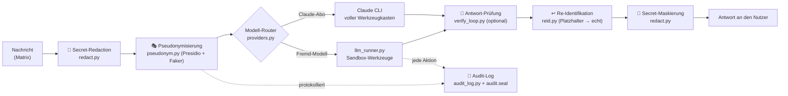

# Operator — Sicherheit & Architektur

**Warum der Operator anders ist: privat, sicher und einfach — im Design, nicht als Zusatz.**

Dieses Dokument beschreibt, wie der Operator aufgebaut ist und welche Sicherheits- und
Datenschutz­garantien seine Module liefern. Es richtet sich an technische wie an
Entscheider-Leser und dient zugleich als sachliche Abgrenzung gegenüber Cloud-Agenten wie
**OpenClaw** und **Hermes**.

---

## 1. In einem Satz

> Der Operator ist ein **KI-Assistent, der auf deiner eigenen Hardware läuft** — er schützt
> personenbezogene Daten und Geheimnisse *bevor* sie ein Sprachmodell je zu sehen bekommen,
> arbeitet nachvollziehbar in abgeschotteten Sandkästen und ist bewusst so gebaut, dass ihn
> auch Nicht-Techniker bedienen können.

Wo klassische KI-Agenten „Daten in die Cloud, Antwort zurück" machen, schiebt der Operator
**vier Schutzschichten** zwischen den Menschen und das Modell — automatisch, bei jeder Nachricht.

---

## 2. Leitprinzipien

| Prinzip | Was es bedeutet | Wo es verankert ist |
|---|---|---|
| **Local-First** | Läuft auf deinem Mac / Raspberry Pi. Dashboard bindet ausschließlich `127.0.0.1`. Kein Zwang zu einer fremden Cloud. | `listener.py` (stdlib-Daemon), `dashboard/server.py` (nur localhost, Host-Whitelist) |
| **Privacy by Design** | Personenbezogene Daten werden **pseudonymisiert, bevor** sie ein externes Modell erreichen — und danach wieder eingesetzt. | `pseudonym.py`, `redact.py`, `reid.py` |
| **Security by Design** | Geheimnisse verschlüsselt, Werkzeuge im Käfig, jede Aktion protokolliert, manipulations­sicheres Audit-Log. | `vault.py`, `secretstore.py`, `llm_runner.py`, `audit_log.py` |
| **Einfachheit / Barrierefreiheit** | Bedienbar ohne Terminal und ohne Fachwissen — für Büromitarbeitende, nicht nur für Nerds. | `EINFACHHEIT.md`, Einrichtungs-Assistent, geführte Formulare |

---

## 3. Der Datenfluss einer Nachricht (das Herzstück)

Jede eingehende Nachricht durchläuft dieselbe Schutz-Pipeline. Das externe Modell sieht **nie**
den echten Namen, die echte E-Mail oder ein Passwort — sondern nur unverfängliche Platzhalter.

**Konkret:** Schreibt jemand *„Ruf Herrn Müller unter müller@firma.de an"*, sieht ein
externes Modell z. B. *„Ruf Herrn Ingeburg Sauerbier unter kontakt@example.org an"*. Die
Antwort wird vor dem Versand automatisch zurückübersetzt. Bewiesen im Test: Surrogat rein,
echter Name raus — die Zuordnung existiert nur flüchtig und lokal.

---

## 4. Die Sicherheits-Module im Überblick

| Modul | Aufgabe | Garantie / Nutzen |
|---|---|---|
| **pseudonym.py** (+ Daemon) | Erkennt PII (Namen, Mails, Telefon, Adressen) via Presidio + deutschem Modell, ersetzt sie durch konsistente, geschlechts­richtige Faker-Surrogate. | Externe Modelle sehen **nie echte Personendaten**. DSGVO-freundlich. Reversibel nur lokal. |
| **redact.py / reid.py** | Maskiert Geheimnisse (Keys, Tokens, Passwörter) vor dem Modell; setzt echte Werte erst beim Ausliefern wieder ein. | Keine Zugangsdaten im Modell-Kontext oder in Logs. |
| **vault.py** | Verschlüsselter Tresor (Envelope-Kryptografie, Recovery-Key), optional **FIDO2-Hardware-Schlüssel**, optional Vaultwarden-Backend. | Zugangsdaten liegen verschlüsselt; Entsperren per Hardware-Token möglich. |
| **secretstore.py** | Plattformübergreifende Ablage im OS-Schlüsselbund (macOS Keychain / Linux Secret Service). | Keine Klartext-Tokens auf der Platte. |
| **llm_runner.py** | Fremd-Modelle inkl. **Werkzeug-Sandkasten** (siehe §5). | Coding-Agenten arbeiten wirklich — aber eingesperrt. |
| **verify_loop.py** | Optional prüft ein **zweites Modell** jede Antwort auf Fehler/Halluzinationen, bevor sie den Nutzer erreicht. | Höhere Verlässlichkeit; Vier-Augen-Prinzip für KI-Antworten. |
| **audit_log.py** (+ `audit.seal`) | Schreibt jede sicherheits­relevante Aktion in ein **manipulations­evidentes** Log (Siegelkette). | Nachträgliche Änderungen am Protokoll sind erkennbar. |
| **listener.py** | Kern-Daemon **ausschließlich mit Python-Standardbibliothek** — kleine, prüfbare Angriffsfläche. | Weniger Abhängigkeiten = weniger Lieferketten-Risiko. |
| **skillguard.py** | Sicherheits-Scan neuer/geänderter Skills. | Schutz vor riskanten Automatisierungen. |
| **persona.py** | Persona (Auftreten) + Nutzerprofil, rein lokal (`persona.json`/`profile.json`). | Personalisierung **transparent**: sichtbar, editierbar, jederzeit löschbar, auditiert — keine verdeckte Bindungs-Mechanik (bewusst; vgl. EU AI Act / EDPS zu KI-Companions). |
| **permission_broker.py** + **claude_tool_hook.py** | Stuft **jeden** Werkzeug-Aufruf ein. Riskante Aktionen (Löschen, `sudo`, Systemdateien, Mail senden, `curl\|bash`) lösen eine Rückfrage im Matrix-Chat aus. | **fail-closed:** ohne ausdrückliches Ja des Owners passiert nichts. Freigabe an einen Argument-Fingerabdruck gebunden, genau einmal verbrauchbar; fremde Sender wirkungslos; Antworten *vor* der Frage zählen nicht. |
| **net_guard.py** | Löst jeden Hostnamen auf und prüft **jede** dabei gefundene IP gegen Loopback, private Netze, Link-Local (inkl. `169.254.169.254`) und reservierte Bereiche. Nur `http`/`https`. | Kein Zugriff auf Dashboard, Router, NAS oder interne Server — auch nicht über **Weiterleitungen** (Prüfung bei jeder einzelnen Browser-Anfrage) oder Zahlenschreibweisen wie `2130706433`. |
| **retention.py** | Löscht abgelaufene lokale Daten: Gesprächsverlauf 30 Tage, Betriebsprotokoll 14, Sicherheits-Audit 90 (einstellbar). Läuft täglich. | Datensparsamkeit ohne Zutun. Gekürzte Dateien behalten `0600`. |
| **claude_health.py** | Erkennt einen abgelaufenen Claude-Zugang und warnt **genau einmal** vor. Probe nur, wenn längere Zeit kein echter Lauf stattfand. | Kein Auflaufen mitten in einer Anfrage. **Ohne jeden Zugriff auf Zugangsdaten** — der Zustand ergibt sich allein aus Rückgabecodes. |
| **throttle.py** | Obergrenze für automatische Läufe (Standard 6/Stunde, 40/Tag). | Ein fehlkonfigurierter Zeitplan kann das Kontingent nicht leerlaufen. **Interaktive Nachrichten werden nie gedrosselt** (test-gesichert). |

---

## 5. Der Werkzeug-Sandkasten (Coding-Agenten)

Damit ein Agent wie `coder` echt arbeiten kann (Dateien anlegen, Befehle ausführen, testen),
ohne zum Risiko zu werden, laufen alle Werkzeuge in einem mehrfach abgesicherten Käfig:

- **Pfad-Käfig:** Datei-Werkzeuge wirken *nur* im eigenen Ordner `workspace/agent-<name>/`.
  Zugriffe nach außen werden **technisch** abgewiesen (`realpath`-Prüfung), nicht per Bitte.
- **Befehls-Sperrliste:** destruktive Muster (`sudo`, `rm -rf /` bzw. `~`, `mkfs`, `dd of=/dev`,
  `shutdown`, `reboot`, `diskutil` …) werden blockiert.
- **Harte Limits:** max. 15 Werkzeug-Schritte pro Nachricht, 60 s pro Befehl, gekappte Ausgaben.
- **Volle Nachvollziehbarkeit:** jeder ausgeführte Befehl landet als `🔧`-Zeile im Log.
- **Datenschutz bleibt aktiv:** Pseudonymisierung und Secret-Maskierung greifen auch hier.

*Belegt:* Der Agent legt Dateien an und führt sie aus; Ausbruchsversuche (`../../etc/passwd`,
`sudo rm -rf /`) werden nachweislich abgewiesen.

**Egress-Schutz für Werkzeug-Ergebnisse:** Was ein Agent aus der echten Welt liest — Shell-
Ausgaben, Datei-Inhalte, Browser-Seitentext — geht **nicht roh** an ein Fremd-Modell. Vor der
Übergabe werden Geheimnisse maskiert und bekannte Personendaten durch dieselben Platzhalter
ersetzt wie im übrigen Gespräch. *Bekannte* Grenze, offen dokumentiert: völlig neue, dem
Gespräch unbekannte Namen aus einer gelesenen Datei erkennt diese Stufe noch nicht — dafür
ist ein zusätzlicher Erkennungs-Durchlauf vorgesehen (Latenz-Abwägung läuft).

**Rückfrage statt Vertrauensvorschuss:** Seit 1.8 hängt vor jedem Werkzeug-Einsatz eine
Einstufung. Harmloses läuft ohne Unterbrechung; alles mit bleibender Wirkung braucht ein
ausdrückliches Ja im Chat (siehe `permission_broker.py` oben).

**Browser-Werkzeug (v1, bewusst eingegrenzt):** Agenten mit dem `Browser`-Werkzeug können im
headless-Browser **navigieren** (`open_page`, `click_link`) und Text/Daten extrahieren — aber
**nur Lesen/Navigieren**, kein Formular-Absenden, keine Käufe, keine Zugangsdaten-Eingabe. Jede
Navigation landet im Log; Timeouts greifen. Web-*Aktionen* mit Bestätigung sind als spätere,
gegatete Stufe vorgesehen (bounded risk statt vollem Desktop-Zugriff).

---

## 6. Abgrenzung: Operator vs. OpenClaw vs. Hermes

**OpenClaw** (Nous-nahe Community, sehr populär) und **Hermes Agent** (Nous Research) sind
beides ebenfalls **selbst-gehostete**, quelloffene Agenten — der Unterschied liegt also *nicht*
in „lokal vs. Cloud", sondern in **Datenschutz-Tiefe, Kanal-Philosophie und Kostenmodell**.
Wettbewerber-Angaben nach öffentlicher Doku (Stand 2026); „nicht dokumentiert" bedeutet: kein
beworbenes Feature — kein Gegenbeweis.

| Kriterium | **Operator** | OpenClaw | Hermes Agent |
|---|---|---|---|
| Betrieb | selbst-gehostet (Mac/Linux/Windows) | selbst-gehostet | selbst-gehostet |
| Chat-Kanäle | **nur Matrix** (bewusst: E2E-fähig, selbst hostbar) | viele (WhatsApp, Telegram, Signal, Discord …) | viele (WhatsApp, Telegram, Signal, Discord …) |
| Daten über Fremd-Plattformen | **nein** (kein Meta-/Telegram-Server im Pfad) | ja, je nach Kanal | ja, je nach Kanal |
| PII-Schutz **vor** dem Modell | **automatische Pseudonymisierung** (Presidio + Faker) | nicht dokumentiert | nicht dokumentiert |
| Geheimnis-Handling | verschlüsselter Tresor + **FIDO2** + Redaction + OS-Schlüsselbund | anbieterabhängig | anbieterabhängig |
| Werkzeug-Ausführung | **abgeschottet** (Pfad-Käfig, Sperrliste, Limits, Audit) | Terminal/Dateien (Sandbox anbieterabhängig) | Terminal/Dateien (dito) |
| Modell & Kosten | **Claude-Abo — kein API-Key, keine Token-Kosten** (oder lokal Ollama/OpenAI/Azure) | API-Key eines Anbieters nötig | API-Key eines Anbieters nötig |
| Rückfrage vor riskanten Aktionen | **ja — im Chat, fail-closed**, Freigabe einmalig und argument-gebunden | Befehls-Freigabe (anbieterabhängig) | Command-Approval |
| Zugriff aufs eigene Heimnetz | **technisch gesperrt**, inkl. Weiterleitungen und Zahlen-IPs | nicht dokumentiert | nicht dokumentiert |
| Werkzeug-Ergebnisse vor dem Modell gereinigt | **ja** (Geheimnisse maskiert, Namen pseudonymisiert) | nicht dokumentiert | nicht dokumentiert |
| Löschfristen für lokale Daten | **ja, automatisch** (30 / 14 / 90 Tage, einstellbar) | nicht dokumentiert | nicht dokumentiert |
| Nachvollziehbarkeit | manipulationsevidentes Audit-Log | nicht dokumentiert | nicht dokumentiert |
| Antwort-Qualitätssicherung | optionale **Zweitmodell-Prüfung** | nicht dokumentiert | nicht dokumentiert |
| Bedienbarkeit | **für Nicht-Techniker** (kein Terminal, geführte Abläufe) | entwicklerzentriert | entwicklerzentriert |

**Ehrliche Einordnung:** OpenClaw und Hermes sind bei der **Kanal-Breite** voraus — das ist
ihr Stärkefeld, und wir holen es bewusst nicht ein. Der Operator setzt den Gegenakzent eine
Ebene tiefer: **was das Modell überhaupt zu sehen bekommt**, wo Geheimnisse liegen, wie viele
Türen offen stehen, und ob der Assistent fragt, bevor er handelt.

**Und das lässt sich nachprüfen.** Der Quellcode ist offen, und **152 automatische Tests**
halten genau diese Zusagen fest — unter anderem:

| Was der Test beweist | Testname |
|---|---|
| Der Browser-Agent kann keine Formulare absenden | `test_browser_tools_are_readonly` |
| 16 interne Ziele sind gesperrt (Dashboard, Router, Cloud-Metadaten, Zahlen-IPs …) | `test_net_guard_blocks_internal_targets` |
| Werkzeug-Ergebnisse werden vor dem Modell gereinigt | `test_tool_result_egress_sanitized` |
| Ein »ja« von vor der Frage gilt nie als Freigabe | `test_broker_alte_zustimmung_gilt_nicht` |
| Fremde Accounts können nichts freigeben | `test_broker_nein_und_fremder_sender` |
| Keine Gesprächsinhalte im Protokoll | `test_no_message_content_in_log` |
| Nur alte Daten werden gelöscht, frische bleiben | `test_retention_deletes_only_old_data` |
| Harmlose Arbeit löst nie eine Rückfrage aus | `test_harmlose_arbeit_fragt_nie_nach` |
| Interaktive Nachrichten werden nie gedrosselt | `test_throttle_limits_automation_never_chat` |
| Der Kern läuft ohne jede Zusatzsoftware | `test_alles_laeuft_ohne_zusatzsoftware` |

Zu den Petra-Tests gehört außerdem eine Gegenprobe: Sie wurden absichtlich zu brechen versucht
(harmlosen Befehl als riskant einstufen, eine Zeichen-Erklärung entfernen, Antworttexte wieder
ins Log schreiben) — alle drei Verstöße wurden gefangen. Tests, die nie fehlschlagen, beweisen
nichts.

---

## 7. Was das für den Betrieb bedeutet (Datenschutz/Compliance)

- **Datensparsamkeit ist eingebaut:** Personenbezogene Daten verlassen die Installation nur
  pseudonymisiert. Das erleichtert DSGVO-konformen Einsatz erheblich.
- **Datenhoheit bleibt beim Kunden:** Wer ein lokales Modell (Ollama) wählt, dessen Daten
  verlassen den eigenen Rechner überhaupt nicht.
- **Prüfbarkeit:** Das Audit-Log dokumentiert sicherheitsrelevante Aktionen manipulationssicher.
- **Geringe Angriffsfläche:** stdlib-only-Kern, Secrets im Schlüsselbund, keine Klartext-Tokens,
  Werkzeuge im Käfig.

---

## 8. Die Grenzen der Microsoft-Anbindung (ehrlich, #122)

Der Operator holt so viel aus Microsoft 365 heraus, wie ohne Copilot-Lizenz geht. Manches
geht aber grundsätzlich nicht — nicht weil wir es nicht gebaut haben, sondern weil Microsoft
es so festlegt. Diese Tabelle ist die verbindliche Antwort auf »warum kann er das nicht?«.

| Was | Warum es nicht (oder nur eingeschränkt) geht | Was stattdessen möglich ist |
|---|---|---|
| **Work IQ / Copilot-Wissen** | Braucht zwingend eine **Copilot-Lizenz** pro Nutzer. Ohne sie liefert die Schnittstelle nichts — es gibt keinen Umweg. | Die Karte im Dashboard bleibt sichtbar, aber **gesperrt und begründet**, statt beim Klick zu scheitern. |
| **Teams-Chatinhalte (app-only)** | Ist eine **Protected API**: Microsoft gibt sie nur nach Antrag **pro Kunde** frei. | Teams-Basisdaten (Teams, Kanäle) gehen ohne Antrag. Inhalte nur über die delegierte Spur. |
| **Microsoft To Do** | Existiert **ausschließlich** delegiert — app-only kennt die Schnittstelle nicht. | Über die persönliche Anmeldung (Device-Code, #116). |
| **`/search/query` (Microsoft Search)** | Ebenfalls nur delegiert. | Mail-Suche über `mail_suchen` (`$search` auf dem Postfach) deckt den Alltagsfall ab. |
| **Enterprise-MCP von Microsoft** | **Public Preview**, ausschließlich lesend, 100 Anfragen/Minute, nur Public Cloud (kein GovCloud, kein China). | Als optionale Karte nutzbar — mit dieser Einschränkung im Text, nicht im Kleingedruckten. |
| **Privatkonten (outlook.com, hotmail)** | Haben **keinen Tenant**. Der app-only-Weg braucht aber genau den. | Privat-Modus über einen eigenen, lesenden MCP-Server mit persönlicher Anmeldung. |
| **Alle Werkzeuge gleichzeitig** | Jedes Werkzeug kostet Platz im Prompt. Bei ~45 Werkzeugen wird jede Antwort spürbar langsamer (real erlebt Anfang Juli). | Drei Voreinstellungen + **Lade-nach-Bedarf**: Es werden nur die Werkzeuge der Dienste geladen, die im Dashboard an sind. |
| **Exchange-Rechte serverseitig eng ziehen** | Eine **Application Access Policy** wirkt nur für Exchange — nicht für OneDrive, SharePoint, Planner oder Teams. | Der Code begrenzt sich zusätzlich freiwillig auf das eigene Postfach. Die Policy ist trotzdem empfohlen (#14). |

**Der Positionierungssatz dazu:** *Scout-Funktionen ohne Copilot-Lizenz — auf deinem Rechner,
mit deinem Datenschutzfilter davor.* Was Microsoft hinter einer Lizenz verschließt, können wir
nicht aufschließen; alles andere holen wir.

---

## 9. Verwandte Dokumente

- `SICHERHEIT.md` — Detail-Sicherheitskonzept (Tresor, Pseudonymisierung, Audit)
- `ARCHITEKTUR.md` — technische Gesamtarchitektur
- `EINFACHHEIT.md` — Leitbild Barrierefreiheit & einfache Sprache (Petra-Test)

*Stand: Version 1.23.1. Dieses Dokument wird mit jedem sicherheitsrelevanten Feature gepflegt.*
