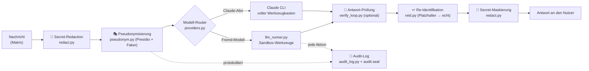

# Operator — Sicherheit & Architektur

**Warum der Operator anders ist: privat, sicher und einfach — im Design, nicht als Zusatz.**

Dieses Dokument beschreibt, wie der Operator aufgebaut ist und welche Sicherheits- und
Datenschutz­garantien seine Module liefern. Es richtet sich an technische wie an
Entscheider-Leser und dient zugleich als sachliche Abgrenzung gegenüber Cloud-Agenten wie
**OpenClaw** und **Hermes**.

---

## 1. In einem Satz

> Der Operator ist ein **KI-Assistent, der auf deiner eigenen Hardware läuft** — er schützt
> personenbezogene Daten und Geheimnisse *bevor* sie ein Sprachmodell je zu sehen bekommen,
> arbeitet nachvollziehbar in abgeschotteten Sandkästen und ist bewusst so gebaut, dass ihn
> auch Nicht-Techniker bedienen können.

Wo klassische KI-Agenten „Daten in die Cloud, Antwort zurück" machen, schiebt der Operator
**vier Schutzschichten** zwischen den Menschen und das Modell — automatisch, bei jeder Nachricht.

---

## 2. Leitprinzipien

| Prinzip | Was es bedeutet | Wo es verankert ist |
|---|---|---|
| **Local-First** | Läuft auf deinem Mac / Raspberry Pi. Dashboard bindet ausschließlich `127.0.0.1`. Kein Zwang zu einer fremden Cloud. | `listener.py` (stdlib-Daemon), `dashboard/server.py` (nur localhost, Host-Whitelist) |
| **Privacy by Design** | Personenbezogene Daten werden **pseudonymisiert, bevor** sie ein externes Modell erreichen — und danach wieder eingesetzt. | `pseudonym.py`, `redact.py`, `reid.py` |
| **Security by Design** | Geheimnisse verschlüsselt, Werkzeuge im Käfig, jede Aktion protokolliert, manipulations­sicheres Audit-Log. | `vault.py`, `secretstore.py`, `llm_runner.py`, `audit_log.py` |
| **Einfachheit / Barrierefreiheit** | Bedienbar ohne Terminal und ohne Fachwissen — für Büromitarbeitende, nicht nur für Nerds. | `EINFACHHEIT.md`, Einrichtungs-Assistent, geführte Formulare |

---

## 3. Der Datenfluss einer Nachricht (das Herzstück)

Jede eingehende Nachricht durchläuft dieselbe Schutz-Pipeline. Das externe Modell sieht **nie**
den echten Namen, die echte E-Mail oder ein Passwort — sondern nur unverfängliche Platzhalter.

**Konkret:** Schreibt jemand *„Ruf Herrn Müller unter müller@firma.de an"*, sieht ein
externes Modell z. B. *„Ruf Herrn Ingeburg Sauerbier unter kontakt@example.org an"*. Die
Antwort wird vor dem Versand automatisch zurückübersetzt. Bewiesen im Test: Surrogat rein,
echter Name raus — die Zuordnung existiert nur flüchtig und lokal.

---

## 4. Die Sicherheits-Module im Überblick

| Modul | Aufgabe | Garantie / Nutzen |
|---|---|---|
| **pseudonym.py** (+ Daemon) | Erkennt PII (Namen, Mails, Telefon, Adressen) via Presidio + deutschem Modell, ersetzt sie durch konsistente, geschlechts­richtige Faker-Surrogate. | Externe Modelle sehen **nie echte Personendaten**. DSGVO-freundlich. Reversibel nur lokal. |
| **redact.py / reid.py** | Maskiert Geheimnisse (Keys, Tokens, Passwörter) vor dem Modell; setzt echte Werte erst beim Ausliefern wieder ein. | Keine Zugangsdaten im Modell-Kontext oder in Logs. |
| **vault.py** | Verschlüsselter Tresor (Envelope-Kryptografie, Recovery-Key), optional **FIDO2-Hardware-Schlüssel**, optional Vaultwarden-Backend. | Zugangsdaten liegen verschlüsselt; Entsperren per Hardware-Token möglich. |
| **secretstore.py** | Plattformübergreifende Ablage im OS-Schlüsselbund (macOS Keychain / Linux Secret Service). | Keine Klartext-Tokens auf der Platte. |
| **llm_runner.py** | Fremd-Modelle inkl. **Werkzeug-Sandkasten** (siehe §5). | Coding-Agenten arbeiten wirklich — aber eingesperrt. |
| **verify_loop.py** | Optional prüft ein **zweites Modell** jede Antwort auf Fehler/Halluzinationen, bevor sie den Nutzer erreicht. | Höhere Verlässlichkeit; Vier-Augen-Prinzip für KI-Antworten. |
| **audit_log.py** (+ `audit.seal`) | Schreibt jede sicherheits­relevante Aktion in ein **manipulations­evidentes** Log (Siegelkette). | Nachträgliche Änderungen am Protokoll sind erkennbar. |
| **listener.py** | Kern-Daemon **ausschließlich mit Python-Standardbibliothek** — kleine, prüfbare Angriffsfläche. | Weniger Abhängigkeiten = weniger Lieferketten-Risiko. |
| **skillguard.py** | Sicherheits-Scan neuer/geänderter Skills. | Schutz vor riskanten Automatisierungen. |

---

## 5. Der Werkzeug-Sandkasten (Coding-Agenten)

Damit ein Agent wie `coder` echt arbeiten kann (Dateien anlegen, Befehle ausführen, testen),
ohne zum Risiko zu werden, laufen alle Werkzeuge in einem mehrfach abgesicherten Käfig:

- **Pfad-Käfig:** Datei-Werkzeuge wirken *nur* im eigenen Ordner `workspace/agent-<name>/`.
  Zugriffe nach außen werden **technisch** abgewiesen (`realpath`-Prüfung), nicht per Bitte.
- **Befehls-Sperrliste:** destruktive Muster (`sudo`, `rm -rf /` bzw. `~`, `mkfs`, `dd of=/dev`,
  `shutdown`, `reboot`, `diskutil` …) werden blockiert.
- **Harte Limits:** max. 15 Werkzeug-Schritte pro Nachricht, 60 s pro Befehl, gekappte Ausgaben.
- **Volle Nachvollziehbarkeit:** jeder ausgeführte Befehl landet als `🔧`-Zeile im Log.
- **Datenschutz bleibt aktiv:** Pseudonymisierung und Secret-Maskierung greifen auch hier.

*Belegt:* Der Agent legt Dateien an und führt sie aus; Ausbruchsversuche (`../../etc/passwd`,
`sudo rm -rf /`) werden nachweislich abgewiesen.

---

## 6. Abgrenzung: Operator vs. OpenClaw vs. Hermes

**OpenClaw** (Nous-nahe Community, sehr populär) und **Hermes Agent** (Nous Research) sind
beides ebenfalls **selbst-gehostete**, quelloffene Agenten — der Unterschied liegt also *nicht*
in „lokal vs. Cloud", sondern in **Datenschutz-Tiefe, Kanal-Philosophie und Kostenmodell**.
Wettbewerber-Angaben nach öffentlicher Doku (Stand 2026); „nicht dokumentiert" bedeutet: kein
beworbenes Feature — kein Gegenbeweis.

| Kriterium | **Operator** | OpenClaw | Hermes Agent |
|---|---|---|---|
| Betrieb | selbst-gehostet (Mac/Linux/Windows) | selbst-gehostet | selbst-gehostet |
| Chat-Kanäle | **nur Matrix** (bewusst: E2E-fähig, selbst hostbar) | viele (WhatsApp, Telegram, Signal, Discord …) | viele (WhatsApp, Telegram, Signal, Discord …) |
| Daten über Fremd-Plattformen | **nein** (kein Meta-/Telegram-Server im Pfad) | ja, je nach Kanal | ja, je nach Kanal |
| PII-Schutz **vor** dem Modell | **automatische Pseudonymisierung** (Presidio + Faker) | nicht dokumentiert | nicht dokumentiert |
| Geheimnis-Handling | verschlüsselter Tresor + **FIDO2** + Redaction + OS-Schlüsselbund | anbieterabhängig | anbieterabhängig |
| Werkzeug-Ausführung | **abgeschottet** (Pfad-Käfig, Sperrliste, Limits, Audit) | Terminal/Dateien (Sandbox anbieterabhängig) | Terminal/Dateien (dito) |
| Modell & Kosten | **Claude-Abo — kein API-Key, keine Token-Kosten** (oder lokal Ollama/OpenAI/Azure) | API-Key eines Anbieters nötig | API-Key eines Anbieters nötig |
| Nachvollziehbarkeit | manipulationsevidentes Audit-Log | nicht dokumentiert | nicht dokumentiert |
| Antwort-Qualitätssicherung | optionale **Zweitmodell-Prüfung** | nicht dokumentiert | nicht dokumentiert |
| Bedienbarkeit | **für Nicht-Techniker** (kein Terminal, geführte Abläufe) | entwicklerzentriert | entwicklerzentriert |

**Ehrliche Einordnung:** OpenClaw und Hermes sind bei der **Kanal-Breite** (viele Messenger)
voraus — das ist ihr Stärkefeld. Der Operator setzt bewusst den Gegenakzent: **Matrix-only +
automatischer PII-Schutz + FIDO2-Tresor + Claude-Abo statt API-Key**. Datenschutz und
Sicherheit sind hier der Bauplan, keine Checkbox.

---

## 7. Was das für den Betrieb bedeutet (Datenschutz/Compliance)

- **Datensparsamkeit ist eingebaut:** Personenbezogene Daten verlassen die Installation nur
  pseudonymisiert. Das erleichtert DSGVO-konformen Einsatz erheblich.
- **Datenhoheit bleibt beim Kunden:** Wer ein lokales Modell (Ollama) wählt, dessen Daten
  verlassen den eigenen Rechner überhaupt nicht.
- **Prüfbarkeit:** Das Audit-Log dokumentiert sicherheitsrelevante Aktionen manipulationssicher.
- **Geringe Angriffsfläche:** stdlib-only-Kern, Secrets im Schlüsselbund, keine Klartext-Tokens,
  Werkzeuge im Käfig.

---

## 8. Verwandte Dokumente

- `SICHERHEIT.md` — Detail-Sicherheitskonzept (Tresor, Pseudonymisierung, Audit)
- `ARCHITEKTUR.md` — technische Gesamtarchitektur
- `EINFACHHEIT.md` — Leitbild Barrierefreiheit & einfache Sprache (Petra-Test)

*Stand: Version 1.5.0. Dieses Dokument wird mit jedem sicherheitsrelevanten Feature gepflegt.*
